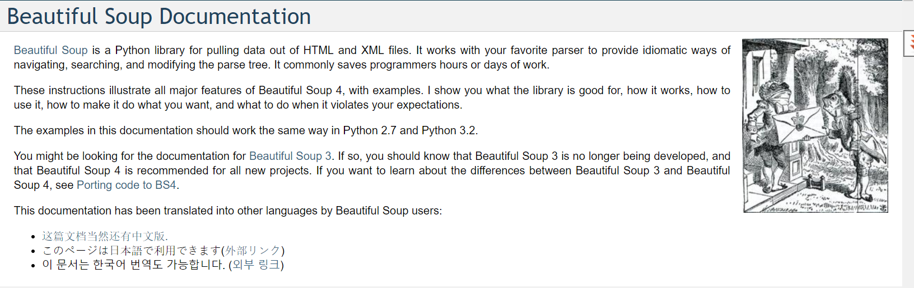

# Application programming interfaces(APIs)
## prepared for DAT-129 at the CCAC

    code samples 
## codeing resources:
[python documentations](https://www.python.org)

## Uses for scraping
1. Learnin the ins and outs of HTML
1. exploring tree-based data structures

this is computer <code> that is autimatically escapes
